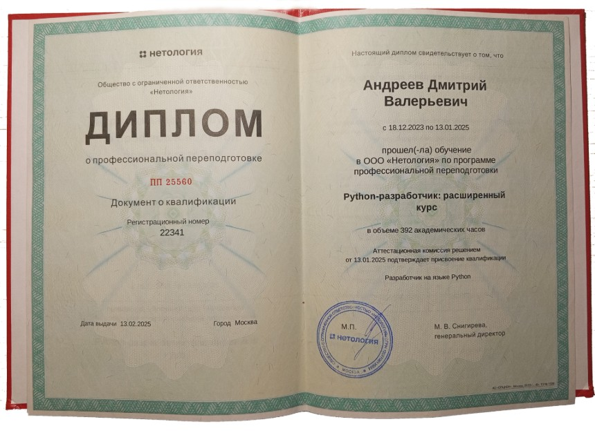

# Андреев Дмитрий

- Телефон +7 (910) 934 14 15 
- e-mail:  dmitri-rt@ya.ru

### - Желаемая должность:
Программист-разработчик, backend.  

### - Занятость и график работы: 
Стажировка, полный день, удаленная работа.

### - Мои инструменты для разработки:
- Python Web Development: Обучаюсь с 2023 года, изучаю современные фреймворки и технологии, включая Django, Flask и FastAPI.
- Объектно-ориентированное программирование (ООП): Применяю принципы ООП для разработки модульного и поддерживаемого кода.
- Работа с GitHub: Использую системы контроля версий для совместной работы над проектами и управления кодом.
- API и ORM: Осваиваю создание и интеграцию REST API, а также использование ORM для работы с базами данных.
- Базы данных: Опыт работы с SQL и PostgreSQL, проектировал и оптимизировал базы данных для веб-приложений.
- Контейнеризация и виртуализация: Использую Docker для настройки и развертывания приложений в контейнерах.
- Фоновая обработка задач с Celery: Реализую асинхронные задачи для повышения производительности приложений.
- Настройка серверов и деплой приложений: Опыт работы с Nginx для управления веб-серверами и Ubuntu для настройки серверной части приложений.
- Кэширование с Redis: Применяю Redis для ускорения работы приложений и уменьшения нагрузки на базы данных.
- CI/CD: Знаком с практиками непрерывной интеграции и доставки для автоматизации развертывания приложений.
- Frontend опыт: До начала обучения в ООО Нетологии, работал с CSS в системе WordPress. Участвовал в создании и поддержке сайта компании, занимался дизайном и изучил Photoshop, внедрив несколько полезных функций для улучшения функциональности сайта.

 
### - Мои учебные проекты:
 - За время учебы выполнил множество домашних заданий и масштабный проект, который предлагаю рассмотреть - [Дипломный проект](https://github.com/Test-Name-Nemo/diplom) 
 - В проекте, разработка backend-приложение сервис заказа товаров для розничных сетей на Django Rest Framework. Проект строго выполнялся на Linux, использовал VirtualBox.

### Стена достижений
#### Диплом и свидетельства подтверждающие об успешном прохождении обучения

### - Навыки 
- Работа с циклами на Python
- Работа с коллекциями данных на Python
- Работа с функциями на Python
- Реализация объектно-ориентированного программирования на Python
- Работа с файловой системой в Python
- Работа с внешним API на Python
- Создание баз данных в PostgreSQL
- Работа с SELECT-запросами и выборкой данных в PostgreSQL
- Работа с базой данных PostgreSQL в Python
- Шаблонопроектирование на Python
- Применение Python на практике
- Работа с запросом и шаблонами в Django
- Работа с ORM в Django
- Взаимодействие с сайтом в Django
- Автоматизация развёртывания на Python
- Работа с расширенным инструментарием к web-разработке на Python
- Установка и настройка Git
- Работа в Git с локальным репозиторием
- Установка и настройка GitHub для собственного проекта
- Работа в Git & GitHub при командной разработке в GitHub
- Работа с Git в различных окружениях (графический интерфейсы, IDE, вебс-сервисы)

### Опыт c предыдущих мест, моего труда.
#####  В Компании ООО Тверькартофель был опыт работы с кодом 'css' в системе WordPress

