# Андреев Дмитрий

- Телефон +7 (910) 934 14 15 
- e-mail:  dmitri-rt@ya.ru

### - Желаемая должность:
Программист-разработчик, backend.  

### - Занятость и график работы: 
Стажировка, полный день, удаленная работа.

### - Мои инструменты для разработки:
- Python web development - обучаюсь с 2024 года
- ООП, GitHub, API, ORM, SQL, PostgreSQL, Docker, Сelery, Nginx, Redis, Ubuntu, CI/CD, Django, Rest Framework, Flacks, FastAPI.

До обучения в ООО Нетологи, работал с css в системе WordPress, участвовал в создании сайта компании и поддерживал его в рабочем состоянии. Дизайн сайта был на мне, изучил Photoshop. Так же внедрил на сайт несколько "фичи"
 
### - Мои учебные проекты:
 - За время учебы выполнил множество домашних заданий и масштабный проект, который предлагаю рассмотреть - [Дипломный проект](https://github.com/Test-Name-Nemo/diplom) 
 - В проекте, разработка backend-приложение сервис заказа товаров для розничных сетей на Django Rest Framework. Проект строго выполнялся на Linux, использовал VirtualBox.

### Стена достижений
#### Свидетельства подтверждающие об успешном прохождении обучения
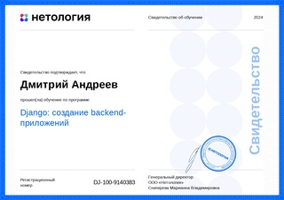
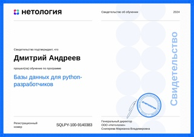
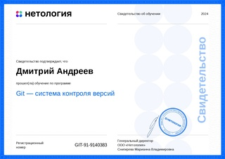
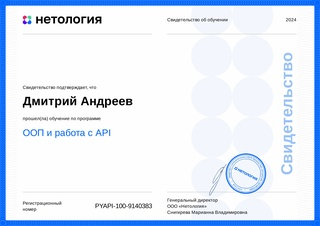
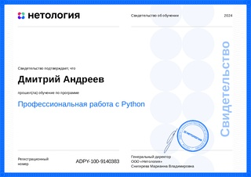
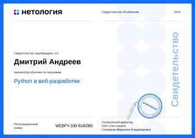
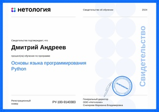
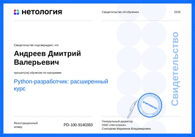
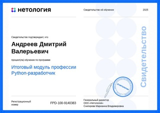

### - Навыки 
- Работа с циклами на Python
- Работа с коллекциями данных на Python
- Работа с функциями на Python
- Реализация объектно-ориентированного программирования на Python
- Работа с файловой системой в Python
- Работа с внешним API на Python
- Создание баз данных в PostgreSQL
- Работа с SELECT-запросами и выборкой данных в PostgreSQL
- Работа с базой данных PostgreSQL в Python
- Шаблонопроектирование на Python
- Применение Python на практике
- Работа с запросом и шаблонами в Django
- Работа с ORM в Django
- Взаимодействие с сайтом в Django
- Автоматизация развёртывания на Python
- Работа с расширенным инструментарием к web-разработке на Python
- Установка и настройка Git
- Работа в Git с локальным репозиторием
- Установка и настройка GitHub для собственного проекта
- Работа в Git & GitHub при командной разработке в GitHub
- Работа с Git в различных окружениях (графический интерфейсы, IDE, вебс-сервисы)

### Опыт c предыдущих мест, моего труда.
#####  В Компании ООО Тверькартофель был опыт работы с кодом 'css' в системе WordPress

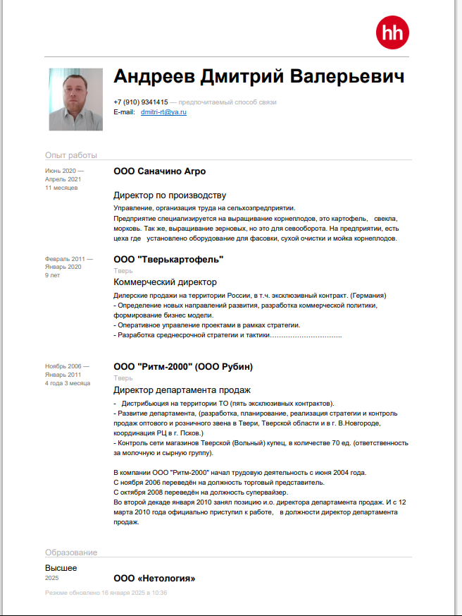

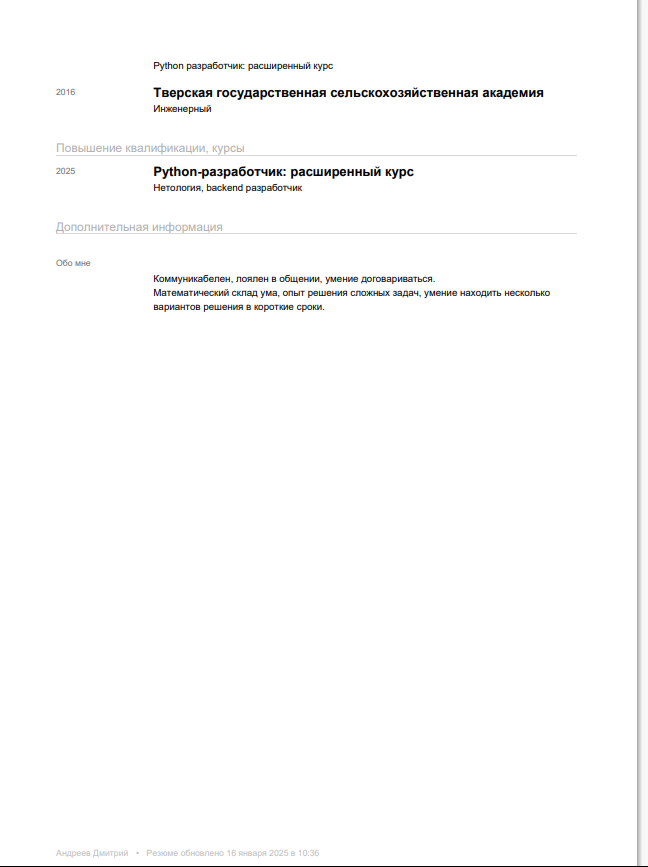

