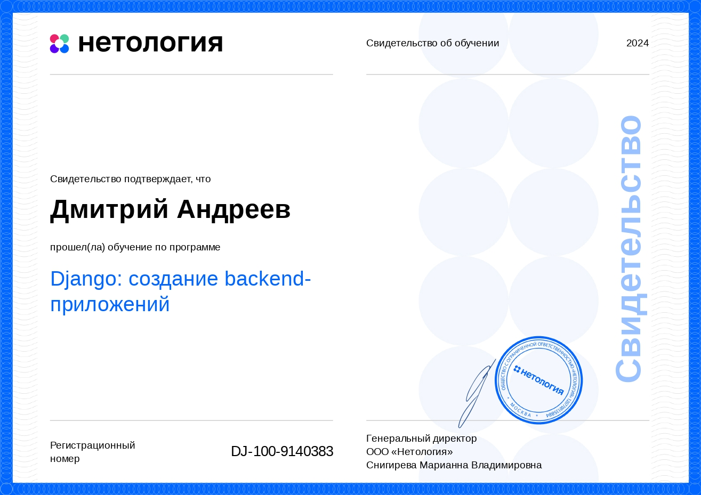
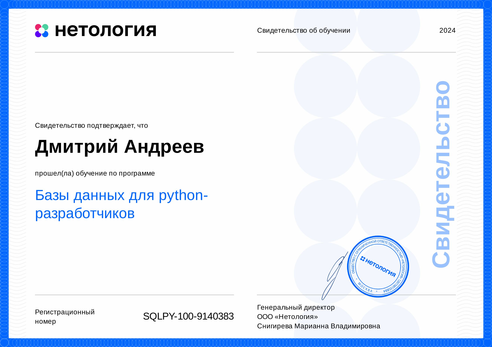
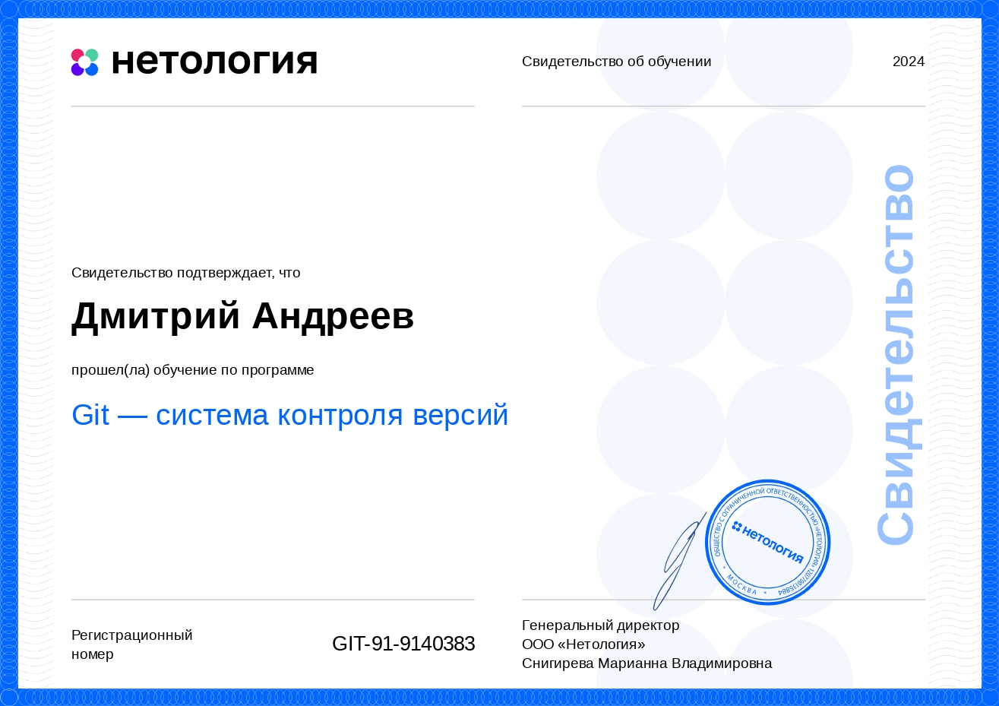
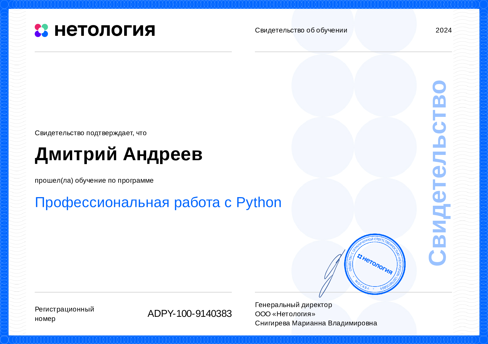
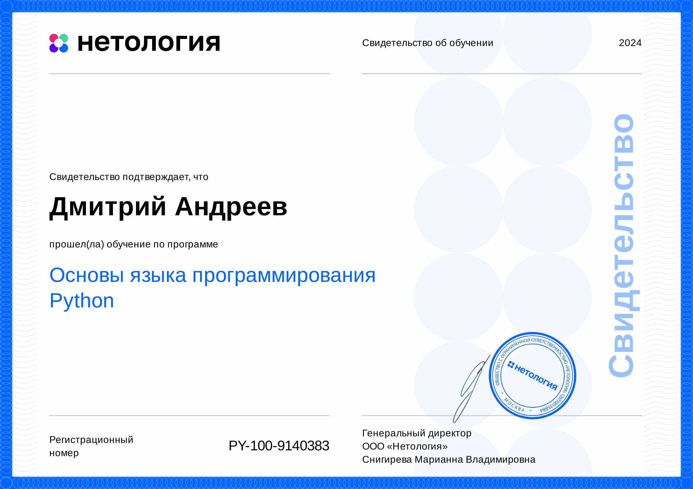
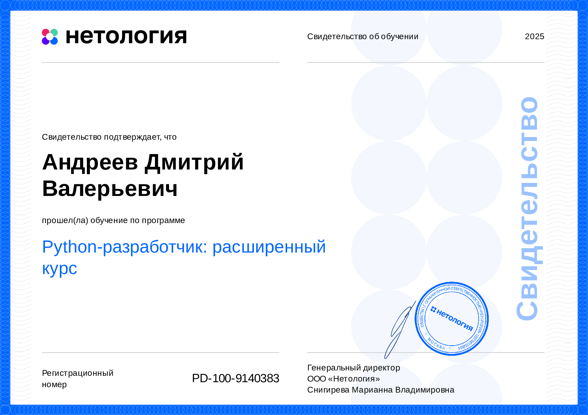

# Андреев Дмитрий

- Телефон +7 (910) 934 14 15 
- e-mail:  dmitri-rt@ya.ru

### - Желаемая должность:
Программист-разработчик, backend.  

### - Занятость и график работы: 
Cтажировка, полный день, удаленная работа.

### - Навыки. Умения. Приобретённые знания:
Python web development, ООП, CI/CD, Docker, JSON, API, PostgreSQL, Nginx, Django Rest Framework, GitHub, Flacks, FastAPI...

До обучения в ООО Нетологи, работал с css в системе WordPress, создал и поддерживал в рабочем состоянии сайт компании. Дизайн сайта был на мне, изучил Photoshop. Так же внедрил на сайт несколько "фичи"

#### Свидетельства подтверждающие об успешном прохождении обучения

### Опыт c предыдущих мест, моего труда.

